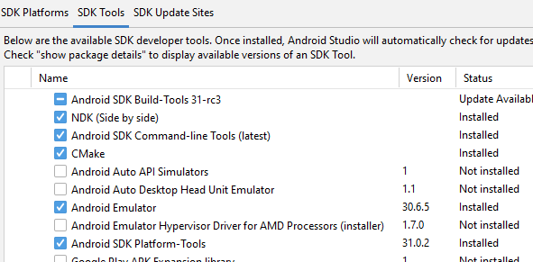

# Rust with Android Studio or Xcode iOS


## Android Studio

* Android Studio Arctic Fox | 2020.3.1 Patch 2
* Android SDK Platform 31
* Android NDK 24.0.8215888
* Android SDK Build-Tools 31.0.0
* Android SDK Command-line Tools
* Android SDK Platform-Tools

#### Config: Tools >> SDK Manager >>  SDK Tools (middle tab):



## Rust

Install rust on your PC from [rustup](https://rustup.rs), 
then add some Android targets (arm64, arm, x86_64, x86) for rust.
```
rustup target add aarch64-linux-android armv7-linux-androideabi i686-linux-android x86_64-linux-android
```
Uses [rust-android-gradle](https://github.com/mozilla/rust-android-gradle) plugin, so is built with the command:
```cli
gradlew cargoBuild
```

### Function naming convention

In `src/lib.rs` you need to name the function according to the following naming convention in order to make it available in `Java`.

If the _Java_ function is called `greeting` and it is saved in a file named `RustBindings.java` pulled from package `com.krupitskas.pong` then in _Rust_ the function name is:

| Java |    package name     |   filename   | function name |
| :--: | :-----------------: | :----------: | :-----------: |
| Java | com_krupitskas_pong | RustBindings |   greeting    |

Which would look like this:

`Java_com_krupitskas_pong_RustBindings_greeting(...)`

## Python

Install [Python](https://www.python.org/downloads/) on your PC.

> In `macOS` Monterey 12.3 and above, python was removed by Apple, you must install [Python3](https://www.python.org/downloads/) by yourself, then run this command to make python3 as python.
> ```
> ln -s -f /usr/local/bin/python3 /usr/local/bin/python
> ```

## iOS

- macOS / Xcode
- `curl https://sh.rustup.rs -sSf | sh`
- `rustup target add aarch64-apple-ios x86_64-apple-ios`
- `cargo install cargo-lipo`
- `cargo lipo --release`


## References
- [Rust Android Gradle Plugin](https://github.com/mozilla/rust-android-gradle)
- [Workshop: Use Rust in iOS Apps](https://github.com/thombles/dw2019rust)
- [One more plugin to build Rust for Android](https://dev.to/willir/one-more-plugin-to-build-rust-for-android-125h)
- [Cargo NDK for Android projects](https://github.com/willir/cargo-ndk-android-gradle)
- [Running Rust on Android](https://blog.svgames.pl/article/running-rust-on-android)
- [Building and Deploying a Rust library on iOS](https://mozilla.github.io/firefox-browser-architecture/experiments/2017-09-06-rust-on-ios.html)
- [Building and Deploying a Rust library on Android](https://mozilla.github.io/firefox-browser-architecture/experiments/2017-09-21-rust-on-android.html)
- [Render Fractal image in Android bitmap with Rust](https://hoangpq.github.io/posts/rust-ndk/)


Done!
